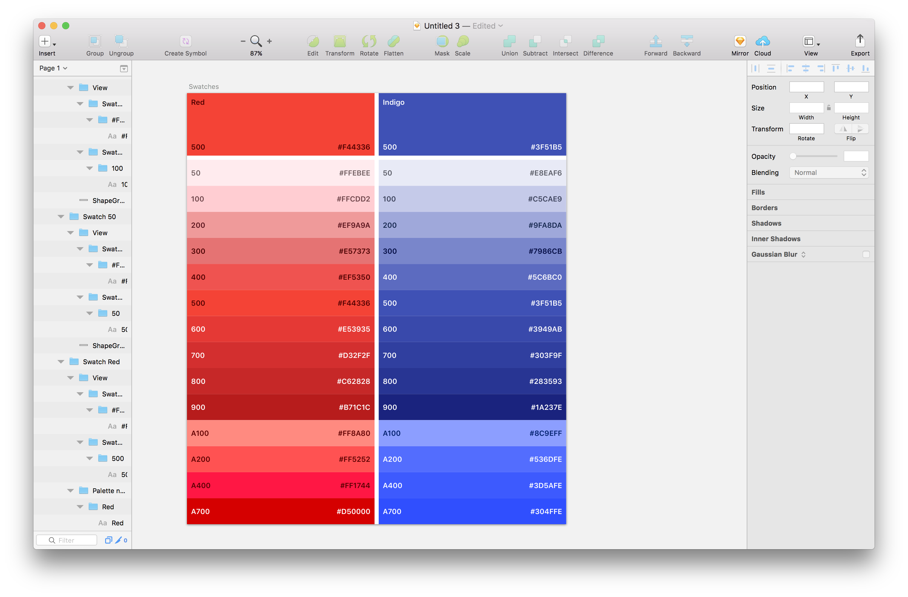

<h1 align="center">
  <br>
  Sketch Palette Generator<br>
  <p align="center">
  <a href="https://twitter.com/madeawkward">
    
  </a>
  </p>
</h1>

This plugin allows you to output a colour palette defined in JSON to Sketch. This plugin is heavily inspired by the [Material Design colour palette](https://material.io/guidelines/style/color.html#color-color-palette).


[📹 Watch demo](https://www.youtube.com/watch?v=bbrRPYByRx8)

## Introduction

Sharing colour palettes between different Sketch files or with developers and keeping everything and everyone in sync can be a tedious process. That's why we at [Awkward](https://awkward.co) created Sketch Palette Generator. Sketch Palette Generator enables designers to define a colour palette in a JSON file and then easily restore them in different Sketch files. JSON files also have the inherent benefit that they can be used by developers (e.g. JSON can be converted to Sass variables using [json-sass](https://github.com/acdlite/json-sass))

## Install

1. [Download the ZIP file and unzip](https://github.com/awkward/sketch-palette-generator/releases/download/v1.0.2/sketch-palette-generator.sketchplugin.zip)
2. Open sketch-palette-generator.sketchplugin

## How to use

1. Download and install the Sketch plugin

2. Define your colour palette in a JSON file

The colour palette should be defined like the [Material Design colour palette](https://material.io/guidelines/style/color.html#color-color-palette). The example below contains two colour groups with each fourteen accents. A colour group can contain any number of accents, **the only requirement is that every group should contain an accent with the key `500`**, as this one is used as the primary colour.

```json
{
  "Red": {
    "50": "#FFEBEE",
    "100": "#FFCDD2",
    "200": "#EF9A9A",
    "300": "#E57373",
    "400": "#EF5350",
    "500": "#F44336",
    "600": "#E53935",
    "700": "#D32F2F",
    "800": "#C62828",
    "900": "#B71C1C",
    "A100": "#FF8A80",
    "A200": "#FF5252",
    "A400": "#FF1744",
    "A700": "#D50000"
  },
  "Indigo": {
    "50": "#E8EAF6",
    "100": "#C5CAE9",
    "200": "#9FA8DA",
    "300": "#7986CB",
    "400": "#5C6BC0",
    "500": "#3F51B5",
    "600": "#3949AB",
    "700": "#303F9F",
    "800": "#283593",
    "900": "#1A237E",
    "A100": "#8C9EFF",
    "A200": "#536DFE",
    "A400": "#3D5AFE",
    "A700": "#304FFE"
  }
}
```

3. Open Sketch and create a new page (⚠️ important, because the plugin will override your current page)

3. Click Plugins > Palette generator

4. Select the JSON file created earlier

5. Done! You should now get something like this:


